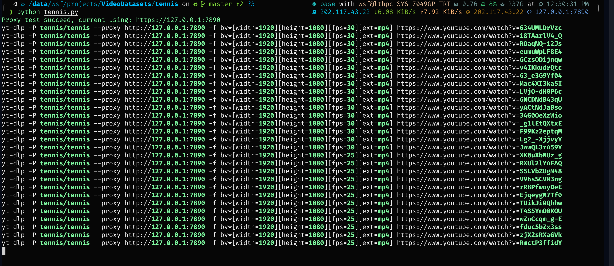

# Video Dataset Downloader


## Overview
Different from image datasets which gives both images and annotations, many video datasets are released as a annotation only files containing youtube id, which means you have to take extra efforts to obtain the videos, i.e. write a crawler by yourself.

Sadly, I didn't find an out-of-box video dataset downloader after I searched on Github. So, I decide to write one by myself.

This repository contains some of the video datasets downloader (not all of them, just ones I'm currently working on). It utilizes the `yt-dlp` library to fetch videos from YouTube based on provided video id provided by the annotations of a video dataset.

`pytube` maybe a possible tool to download the video, but till now 19.03.2024 (Version 15.0.0), there is some bugs in `pytube` and **FAILS** to download some video.

>In detail, it tries to emulate as an `Android` or `Android Embedded` device to fetch the youtube video. **But it some times falls to download a video and recognize it as an age-restricted video, even though it is NOT**. 
>
>Simply login in to Youtube cannot fix the problem, and either solutions from StackOverFlow and Github Issues can fix it.

That's the reason why I use `yt-dlp`. I didn't check the source code of `yt-dlp`, but after I tried it out, it works perfectly. Though I don't know how it works, it works fine. So I just use it.


## Prerequisites

Some packages need to be installed before using the repository.

- Python 3.x (I used 3.12, but should be fine for 3.10/11)
- Required libraries: `pandas`, `yt_dlp`, `colorama`
- Internet connection
- Proxy software configured and running

See `requirements.txt` for more information.

## Instructions

### Proxy

If you don't have direct access to YouTube like me, you need a proxy software to fetch streams from YouTube. 

**NOTE: Configurations for proxy is implemented in the code, if you don't need it, very limited effort is needed to comment the proxy.**

### Invalid Videos

Sadly but true, some YouTube video given by the datasets has been invalid, because of the video is deleted or the uploader account has been closed.

Program will throw an error warning you about this video when downloading, but will not stopped. Check your research requirements to see if that is ok for you. 

I think losing ~10/~200 is acceptable. **So I didn't do extra efforts to finds the lost videos.** If you do need them, just modify the url in the codes, for `yt-dlp` can also download from sources other than YouTube.


## Usage
1. Update the `main` function with the desired output directory, proxy port, and IP address.
2. Configure your proxy software with the specified IP address and port.
3. Run the script to download tennis videos from YouTube.

## Example
```python
if __name__ == "__main__":
    main(Path(__file__).resolve().parent / "output_directory", 7890, "127.0.0.1")
```

## Note
- Ensure the proxy software is running and correctly configured before executing the script.
- The script will download videos based on the information provided in the CSV file.

## Disclaimer
- The script is provided as-is and may require modifications based on specific requirements or changes in external dependencies.


# Beg a star
If this repository do helps you and saves your time, please do give a star. That's a huge encourage to me :)